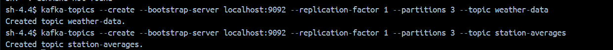
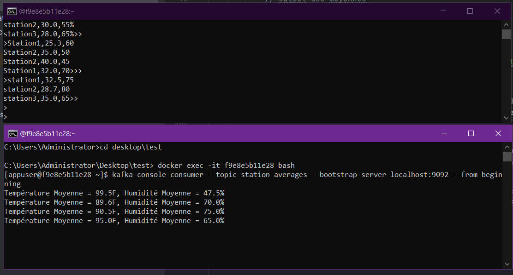

# Real-Time Weather Data Processing with Kafka Streams

## Overview
This project involves creating a Kafka Streams application to process real-time weather data. The data is sent by multiple weather stations to the "weather-data" topic and includes temperature and humidity readings. The goal is to filter, transform, and aggregate this data, then publish the results to the "station-averages" topic.

## Data Format
Each message in the "weather-data" topic follows the format:
station,temperature,humidity

## Steps in the Application
1. **Read Data**: The application reads weather data from the "weather-data" Kafka topic using a KStream.
2. **Filter High Temperatures**: It filters out records where the temperature is ≤ 30°C, retaining only those > 30°C.
3. **Convert to Fahrenheit**: Temperatures in Celsius are converted to Fahrenheit using the formula:
Fahrenheit = (Celsius × 9/5) + 32

4. **Group by Station**: The data is grouped by station to calculate the average temperature and humidity for each station.
5. **Publish Results**: Aggregated results are written to the "station-averages" topic.

## Example

### Input:
Station1,25.3,60 Station2,35.0,50 Station2,40.0,45 Station1,32.0,70

### Output:
Station2: Average Temperature = 37.5°F, Average Humidity = 47.5% Station1: Average Temperature = 31.65°F, Average Humidity = 65%

## Tools and Concepts Used
- **Kafka Streams**: For real-time data processing.
- **KStream & KGroupedStream**: For reading and grouping data.
- **Serialization**: Ensures correct data format handling.
- **Shutdown Hook**: To gracefully stop the application.

  

## Conclusion
The Kafka Streams application efficiently filters, transforms, and aggregates weather data, providing real-time insights into the weather conditions of each station.
This is a concise, formatted README that explains your Kafka Streams application’s goal, steps, example data, tools, and conclusion.
